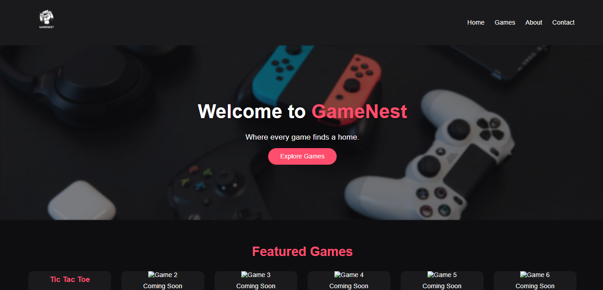
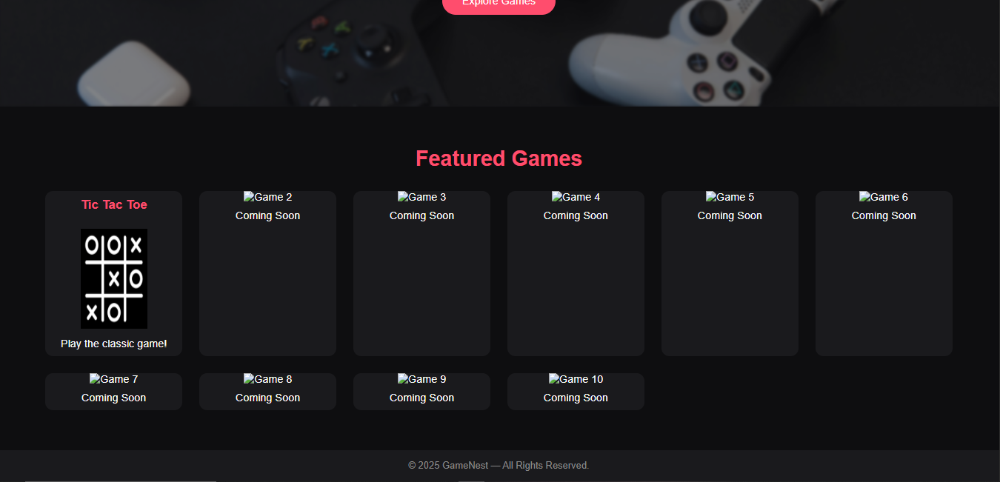
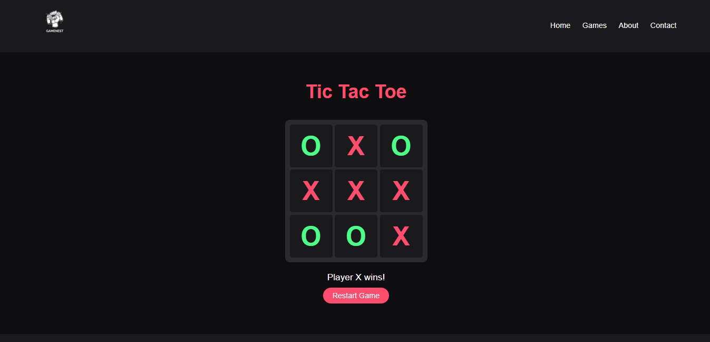

# 🎮 GameNest

**GameNest** is a fun, responsive game website built using **HTML**, **CSS**, and **JavaScript**.  
It features a collection of browser-based mini games — all in one cozy digital nest 🪶.

---

## 🌟 Features

- 🎨 **Modern, responsive UI** using HTML & CSS
- ⚡ **Smooth scrolling** and simple interactivity with JavaScript
- 🕹️ **10 Featured Game Slots**
- 🧭 **Sticky navigation bar** and smooth transitions
- 💻 **Optimized for desktop and mobile**

---

## 🖼️ Preview

---

## 📁 Project Structure

- `index.html` — Home page and game launcher
- `tictactoe.html` — Tic Tac Toe game page
- `script.js` — Main site interactivity
- `tictactoe.js` — Tic Tac Toe game logic
- `style.css` — Global styles and layout
- `README.md` — Project documentation
- `GameNest1.png` — Screenshot preview 1
- `GameNest2.png` — Screenshot preview 2
- `GameNest3.png` — Screenshot preview 3
- `hero.jpg` — Hero image asset
- `logo.png` — Site logo asset
- `tictactoe.png` — Tic Tac Toe asset image
